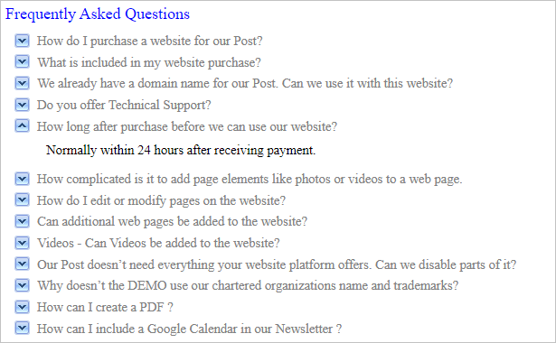

<!-- default badges list -->

<!-- default badges end -->
<!-- default file list -->

# NavBar for ASP.NET Web Forms - How to create the FAQ Page
<!-- run online -->
**[[Run Online]](https://codecentral.devexpress.com/e2342/)**
<!-- run online end -->

The example demonstrates how to create the [ASPxNavBar](https://docs.devexpress.com/AspNet/DevExpress.Web.ASPxNavBar) groups and items at runtime to create a FAQ page. 

Data can be obtained from any type of a datasource. In this example, the data is obtained from the Access database file using the OLE DB provider.

## Files to Review

* [Default.aspx](./CS/Default.aspx) (VB: [Default.aspx](./VB/Default.aspx))
* [Default.aspx.cs](./CS/Default.aspx.cs) (VB: [Default.aspx.vb](./VB/Default.aspx.vb))
